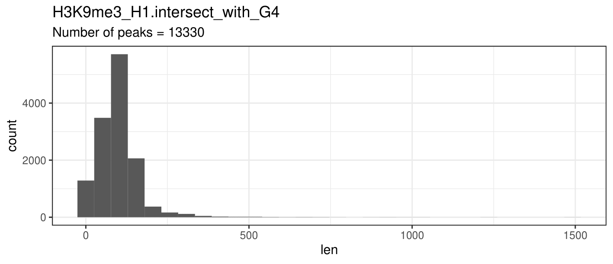
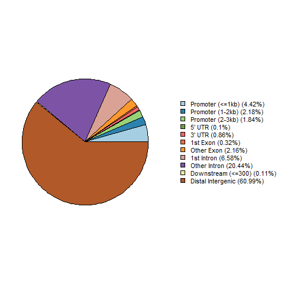

# Проект по майнору Биоинформатика, ВШЭ 2021

### О проекте

Целью работы над проектом является поиск и изучение участков генома, где определенная гистоновая метка присутствует в местах образования вторичной структуры ДНК (квадруплекс, G4).

* **Организм:** human
* **Сборка генома:** hg19
* **Структура:** G4
* **Метка:** H3K9me3
* **Типы клеток:** A549, H1, H9, SK-N-SH

### Список участников

| Участник | Группа | Тип клеток | Индивидуальный репозиторий |
|--|--|--|--|
| Соломенцев Ярослав | 2 | H9 | [https://github.com/YaroslavSolo/hse21_H3K9me3_G4_human](https://github.com/YaroslavSolo/hse21_H3K9me3_G4_human) |
| Усенкова Мария | 3 | H1 | [https://github.com/mausenkova/hse21_H3K9me3_G4_human](https://github.com/mausenkova/hse21_H3K9me3_G4_human) |
| Ляхова Ксения | 3 | А549 | [https://github.com/KseniyaLyakhova/hse21_H3K9me3_G4_human](https://github.com/KseniyaLyakhova/hse21_H3K9me3_G4_human) |
| Мелихедов Артем | 2 | А549 | [https://github.com/ARATOMI/hse21_H3K9me3_G4_human](https://github.com/ARATOMI/hse21_H3K9me3_G4_human) |
| Богданова Алина | 3 | SK-N-SH | [https://github.com/bbogdanovaalina/hse21_H3K9me3_G4_human](https://github.com/bbogdanovaalina/hse21_H3K9me3_G4_human) |
| Бессонов Кирилл | 3 | HCT116 | [https://github.com/muhuraque/hse21_H3K9me3_G4_human](https://github.com/muhuraque/hse21_H3K9me3_G4_human) |

## Отчёт

### Введение

**H3K9ME3** - это эпигенетическая модификация гистона **H3** упаковочного белка ДНК. Эта метка, указывает на триметилирование на **9**-х лизин-остатках белка **H3** гистона и часто ассоциируется с гетерохроматином.

> **H3K9me3** is an epigeneticmodification to the DNA packaging protein Histone **H3**. It is a mark that indicates the tri-methylation at the **9**th lysine residue of the histone **H3** protein and is often associated with heterochromatin.

**H3K9ME3** имеет роль не только в злокачественном, но и в нормальном развитии клетки, выступая в качестве репрессора наследственных неуместных генов и поддерживая раннюю целостность клетки и геномную стабильность. В начале 2000 года ряд групп предоставили доказательства его важности в взаимодействии с эволюционно консервативным аминомосковным хромодоменом гетерохроматина белка 1 (HP1), отличительной чертой гетерохроматина, тем самым набирая его к определенному Chromatin Loci (15-17).

> **H3K9me3** has a role not only in malignancy but in normal cellular development, acting as a repressor of lineage inappropriate genes and maintaining early cell integrity and genomic stability. In the early 2000's a number of groups provided evidence of its importance in interacting with the evolutionarily conserved amino terminal chromodomain of heterochromatin protein 1 (HP1), a hallmark of heterochromatin, thereby recruiting it to specific chromatin loci (15–17).

Альтернативный подход к исследованию кода гистона выявил другую роль для **H3K9ME3** в AML. Некоторые доказательства говорят о роли для **H3K9ME3**, связанной с активацией либо в качестве одиночной метки путем избирательного взаимодействия с РНК-полимеразой II для содействия удлинению мРНК и транскрипционной активации или через определенный кодовой код гистона в фундаментальных генах с активацией гистона **H3K9AC** и **H3K4ME2**.
 
> An alternative approach to investigating the histone code has identified an opposing role for **H3K9me3** in **AML**. Some evidence postulates a role for **H3K9me3** as associated with activation either as a solo mark by selectively interacting with RNA polymerase II to promote mRNA elongation and transcriptional activation or through a specific histone code co-localizing on fundamental genes with activating histone marks **H3K9ac** and **H3K4me2** .

### Обзор исходных файлов

| Участник | Организм | Тип клетки | Эксперимент 1 | Эксперимент 2 | Число пиков |
|--|--|--|--|--|--|
| Соломенцев Ярослав | human | H9 | ENCFF073SPO | ENCFF305RWK |  |
| Усенкова Мария | human | H1 | ENCFF587TWB | ENCFF697NMG | 13330  |
| Ляхова Ксения | human | А549 | ENCFF444EWQ | ENCFF811QUJ | 6783  |
| Мелихедов Артем | human | А549 | ENCFF494QKI | ENCFF164FDB | 27281 |
| Богданова Алина | human | SK-N-SH | ENCFF501EUA | ENCFF709THW |  |
| Бессонов Кирилл | human | HCT116 | ENCFF723YDW | ENCFF070HBN |  |

**После пересечения:** -TBA-

### Длинны пиков

### Расположение относительно аннотированных генов
#### H3K9me3_A549.intersect_with_G4_Li_KPDS

#### H3K9me3_H1.intersect_with_G4_Li_K

#### H3K9me3_A549.intersect_with_G4_Li_K

